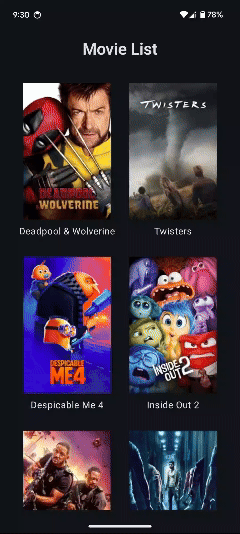

# MovieList App

**MovieList App** is a sample Android application that fetches and displays a list of movies from TMDB public API. It showcases modern Android development practices using Jetpack Compose, MVVM architecture, and other best practices.

## Demo

## Features
- Display a list of popular movies with pagination.
- Detailed view of each movie with information such as title, runtime, rating, release date, genre, and summary.
- Handle network connectivity changes and display a no-internet screen

## Architecture
The app is designed using the MVVM (Model-View-ViewModel) architecture pattern, which ensures a clear separation of concerns:

- **Model**: Contains data classes and repository classes responsible for fetching and managing data.
- **ViewModel**: Manages UI-related data and interacts with the repository.
- **View**: Composes the UI using Jetpack Compose.

## Technology Stack
- **Kotlin:** Programming language used for development.
- **Jetpack Compose**: Modern UI toolkit for building native UI.
- **Hilt**: Dependency injection library for managing dependencies.
- **Retrofit**: HTTP client for network operations.
- **Paging 3**: For handling large datasets with pagination.
- **Coroutines**: For asynchronous programming.
- **Coil**: For image loading
- **Mockito**: For creating mock objects and verifying interactions in tests.

## Key Values Demonstrated
- **Performance**: The app leverages Retrofit for efficient network operations and Paging 3 to handle large datasets with smooth pagination. The UI is built with Jetpack Compose, which ensures a responsive and performant user experience.

- **Readability**: Code is organized into clearly named packages and classes. Composables are modular, with descriptive names that make the code easy to understand and follow.

- **Maintainability**: The MVVM architecture and clean separation of concerns make the app easy to maintain and extend. The use of dependency injection with Hilt helps manage dependencies efficiently.

- **Testability**: The app includes unit and integration tests to ensure correctness and reliability. ViewModel tests validate state management and interactions with repositories, while repository tests verify data retrieval and error handling from APIs. Compose UI tests ensure that UI components render correctly and handle user interactions.

- **Scalability**: The architecture supports adding new features with minimal changes to existing code. The use of Paging 3 and Retrofit allows the app to handle a growing dataset effectively.

- **Simplicity**: The app's design and codebase are kept simple and straightforward, focusing on core functionalities and a clean user interface. Jetpack Compose enables a declarative approach to building UIs, reducing complexity.